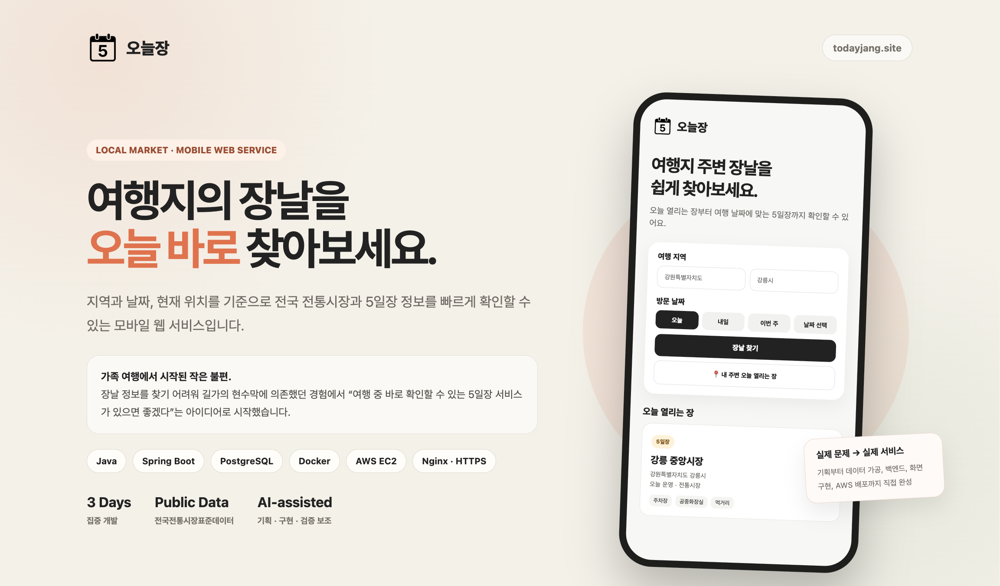

<p align="center">
  
</p>

# 오늘장

여행 지역과 날짜, 현재 위치를 기준으로  
전국 전통시장과 5일장을 쉽게 찾을 수 있는 모바일 웹 서비스입니다.

🔗 **Service**: https://todayjang.site

---

## 💡 Project

가족 여행 중 5일장 정보를 찾기 어려워
도로의 현수막을 통해 장날을 확인했던 경험에서 시작했습니다.

공공데이터를 활용해 여행 중 필요한 장날 정보를
더 빠르고 직관적으로 확인할 수 있도록 구현했습니다.

---

## 🤖 AI 활용

기획, 데이터 분석, 구현 방향 검토, 디버깅, 문서화 등
개발 전 과정에서 ChatGPT를 보조 도구로 활용했습니다.

AI의 결과를 그대로 적용하기보다 직접 검증하고 수정하며 활용했고,
이를 통해 아이디어 구체화부터 구현과 배포까지 약 **3일 동안 집중 개발**하여
실제 사용할 수 있는 서비스로 완성했습니다.

---

## 🛠 Tech Stack

### ☕️ Backend
- Java
- Spring Boot
- Spring Data JPA
- REST API

### 🗄️ Database
- PostgreSQL

### 🎨 Frontend
- HTML
- CSS
- JavaScript

### ☁️ Infra
- Docker
- Docker Compose
- AWS EC2
- Nginx
- HTTPS

---

## 🏗 Architecture

```text
Client
  │
  │ HTTPS
  ▼
Nginx
  │
  ▼
Spring Boot
  │
  ▼
PostgreSQL